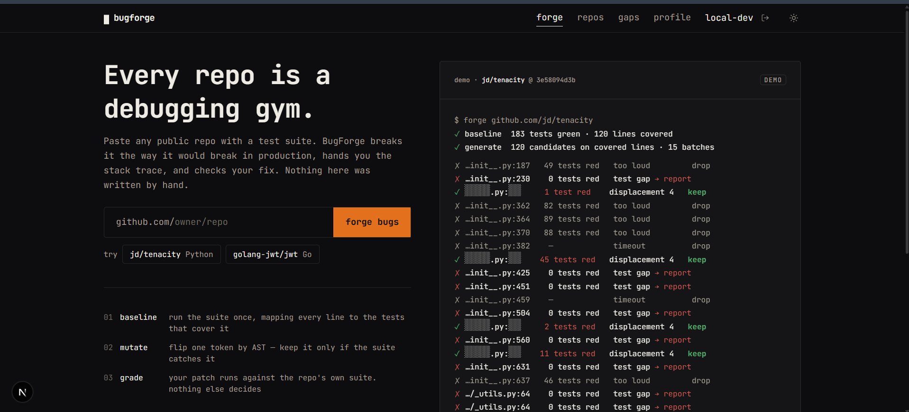
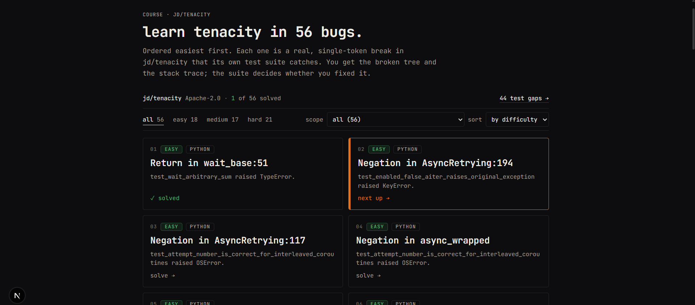
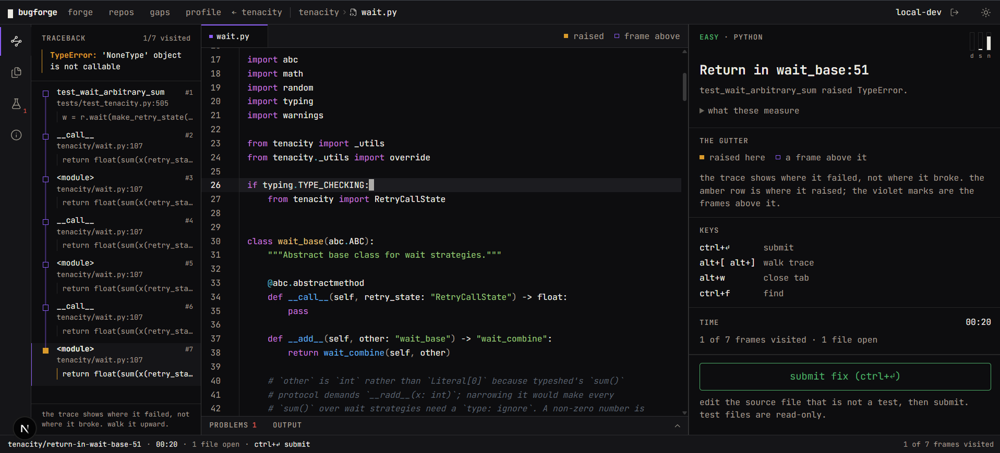
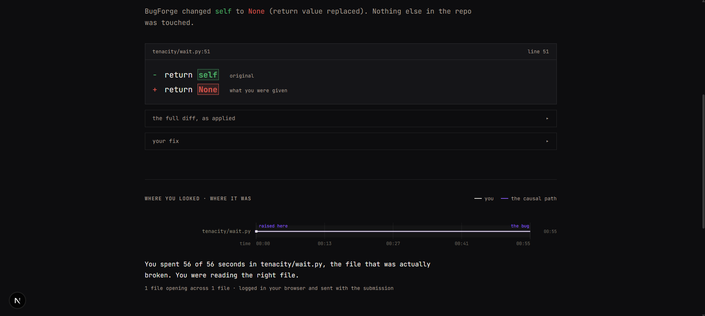
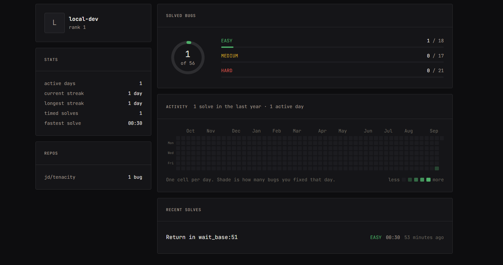

# BugForge

**Practice debugging on real open source code, with bugs nobody wrote by hand.**

BugForge takes a real repository, breaks it in one place, proves the break is
catchable by that repository's own test suite, and hands you the broken tree
with a failing test. You find the bug and patch it. The repository's real test
suite decides whether you were right. No model grades you, and the grading path
has no access to the answer.


---

## Contents

- [Why this exists](#why-this-exists)
- [Screens](#screens)
- [How the pipeline works](#how-the-pipeline-works)
- [Difficulty is measured, not guessed](#difficulty-is-measured-not-guessed)
- [Grading](#grading)
- [Anti-cheat](#anti-cheat)
- [The one model call, and what it is not allowed to say](#the-one-model-call-and-what-it-is-not-allowed-to-say)
- [Features](#features)
- [Tech stack](#tech-stack)
- [Running it](#running-it)
- [What is real and what is a local stand-in](#what-is-real-and-what-is-a-local-stand-in)
- [Repository layout](#repository-layout)
- [Verification](#verification)

---

## Why this exists

Every coding practice platform drills the same motion: blank editor, problem
statement, write a function from scratch. That is the part of the job a working
engineer does least.

The actual work, and increasingly the interview, is the opposite shape. You are
dropped into a codebase you did not write. Something is broken. There is a
stack trace, and it is pointing at a line that is not the problem. You have to
reason backwards from a symptom to a cause, in code you have never read.

Nobody practises that deliberately, because building the exercise is hard. You
need a codebase that is genuinely broken, broken in an interesting way, and a
guarantee that it is fixable.

BugForge generates those automatically. The load-bearing idea is that **a
mutation is only a good exercise if the repository's own tests catch it.** That
single filter buys three things at once:

- **A ground truth.** The bug is fixed when the suite goes green. Nothing else
  has to judge it, so there is no rubric, no model, and no answer key in the
  grading path.
- **A difficulty signal.** How far the failing test sits from the broken line,
  how many files that test executes, and how loudly it fails are all measurable
  before a human sees the challenge.
- **A byproduct that may be worth more than the challenges.** A mutation the
  suite does *not* catch is a hole in that repository's test coverage. Those are
  collected and published as a test gap report.

That last point deserves to be said plainly: the same machinery that makes
practice problems is a coverage auditor for any repository you point it at.

---

## Screens

### Forging a repo



The run streams as it happens: 183 tests green at baseline, 120 candidates on
covered lines, 15 batches. Each row is one mutation and its verdict. Note the
`keep` rows have their file and line **masked**, because a learner who can read
the location off the stream has already solved the challenge. The `test gap`
rows are mutations the suite never noticed.

### Picking a bug



56 bugs from one repository, ordered easiest first, with the bands cut from this
repo's own score distribution rather than at fixed thresholds. Solved challenges
are ticked and the next unsolved one is highlighted. The test gap count links
through to the coverage report.

### Solving



The left rail is the parsed traceback, seven frames, clickable. `alt+[` and
`alt+]` walk it, opening each file at the right line. The gutter separates the
frame that **raised** from frames above it.

The right rail breaks difficulty into the three things that were actually
measured, never one opaque number. Test files open read-only, because the suite
is the grader.

This is the core of the product in one screenshot: the `TypeError` surfaces at
`wait.py:107`, and the bug is at `wait.py:51`.

### After a pass



The mutation is revealed only after the suite goes green: one token, `self` to
`None`, with a link to the real line on GitHub at the pinned commit.

Below it, the investigation replay draws which files you opened and when against
the causal path from crash to cause, and says in a sentence whether you were
reading the right file.

### Your record



Solved against total, per band, a year of activity, streaks, and recent solves.
Signed out this still works from the browser's own record; signing in merges the
two rather than replacing one with the other.

---

## How the pipeline works

Eight stages orchestrated by AWS Step Functions, all running against one
container image with the target repository and its full test dependencies baked
in at build time. Nothing is cloned or installed at request time.

```
Baseline -> Generate -> AnyCandidates -> RunBatches -> Score -> ScoringComplete -> Describe -> Persist
```

### 1. Baseline (`cloud/handlers/fn_baseline.py`)

Run the suite once under coverage and build a **line-to-tests map**: for every
executable line, which tests actually execute it. This map is the spine of
everything downstream and is also inverted into a test-to-files map, which the
scorer uses for search space.

A repository whose suite is not green here is rejected outright. A red baseline
has no usable signal, and the container build runs the suite too so that this is
found at build time rather than fifteen minutes into a run.

### 2. Generate (`bugforge/mutate.py`)

Walk the AST and collect mutation sites. Eight operators:

| operator | example |
|---|---|
| `RETURN` | `return self` becomes `return None` |
| `BOUNDARY` | `<=` becomes `<` |
| `COMPARISON` | `==` becomes `!=` |
| `NEGATION` | `not x` becomes `x` |
| `BOOLEAN` | `and` becomes `or` |
| `ARITHMETIC` | `+` becomes `-` |
| `DEFAULT_ARG` | a default value is changed |
| `TYPE_CHECKING` | an `isinstance` check is flipped |

Each flips exactly one token. Only lines the baseline proved are covered become
candidates, so no time is spent on code no test reaches. Candidates are cut into
batches of roughly fifteen.

### 3. RunBatches

A Step Functions **Distributed Map** fans the batches out. Each worker applies
one mutation to a scratch copy of the tree and runs **only the tests the
baseline says cover that line**. This targeted run is what makes the whole thing
affordable: a full suite per mutation would be unusable at this candidate count.

### 4. Score and classify (`bugforge/select.py`)

Every mutation lands in exactly one of six outcomes:

| outcome | meaning |
|---|---|
| `ADMITTED` | the suite caught it and it scored well enough to be a challenge |
| `TEST_GAP` | the covering tests ran and stayed green: a real coverage hole |
| `DROP_too_loud` | it broke so much of the suite that the trace gives it away |
| `DROP_low_score` | catchable, but too easy to be worth solving |
| `DROP_timeout` | it caused a hang |
| `DROP_catastrophic` | the tree stopped importing |

On the bundled tenacity run: 56 admitted, 48 test gaps, 16 dropped.

### 5. Describe (`cloud/describe.py`)

Generate a bug-ticket title and a one-line symptom, for example
"test_wait_arbitrary_sum raised TypeError". See
[the section on the model call](#the-one-model-call-and-what-it-is-not-allowed-to-say).

### 6. Persist (`cloud/handlers/fn_persist.py`)

Package the broken tree, write the challenge rows to DynamoDB, upload the public
tree and the sealed answer to their two separate S3 prefixes, and publish the
gap report. Each challenge is written as it is packaged, so a timeout loses the
tail of a run rather than the whole run.

---

## Difficulty is measured, not guessed

Each admitted challenge gets a score from 1 to 10 built from three measured
quantities:

```
d = min(displacement, 4) / 4        # stack frames between the failure and the bug
s = min(search_space, 20) / 20      # source files the failing test executes
n = 1 - min(noise * 40, 1)          # inverse of the fraction of the suite that went red

score = clamp(1, 10, 1 + 9 * (0.45*d + 0.25*s + 0.30*n) - name_leak)
```

**Displacement is weighted highest** because it is the thing being trained. A
bug whose traceback points straight at it is a typo hunt. A bug four frames
above where the exception surfaced is a real investigation. The bundled tenacity
challenge is a clean example: the `TypeError` is raised at `wait.py:107` and the
mutation is at `wait.py:51`, inside `__radd__`.

**Noise is inverted on purpose.** If one mutation turns half the suite red, the
intersection of the failures points at the cause immediately. A single quiet
failure gives you far less to triangulate from, so it scores higher.

**`name_leak` is a penalty.** If the failing test is called `test_radd` and the
broken function is `__radd__`, the name has given the answer away, so a full
point is subtracted.

**Bands are cut per repository, not at fixed thresholds.** Fixed cuts at 5 and 7
put 51 of tenacity's 56 bugs into "medium", which makes the label carry no
information and makes the filter that uses it useless. The score is only
meaningful relative to the rest of the repo anyway: a 6.5 is a hard bug in a
shallow codebase and an easy one in a deep one. Ties are not broken, so if a
third of the scores are identical the band holding them is larger than a third.
That is the honest answer.

---

## Grading

`cloud/handlers/fn_grade.py`. No model, no hidden tests, no heuristics.

1. **Patch hygiene via the AST**, before the tree is touched at all.
2. **Apply** the patch to a clean extraction of the broken tree. Line endings
   are normalised and the patch is newline-terminated, because `git apply`
   rejects a final hunk without a terminator, which is what a browser produces.
3. **Run the full suite**, not just the failing test, so a fix that breaks
   something else fails.
4. **Verdict.** All green is `PASS`. Otherwise `FAIL`, naming the tests still
   red. Hygiene failures are `REJECTED` with a reason.

The green check is `num_failed == 0 and returncode == 0 and passed > 0`. The
last clause is not redundant: a patch that ends the test process early and
quietly, such as `os.Exit(0)` in Go code, produces a run with no results that
otherwise looks identical to success.

**The grading function has no IAM permission to read the `answers/` prefix at
all.** It does not need one. The mutation was selected precisely because the
suite catches it, so a green suite is itself the proof. A separate function with
a different role serves the reveal, and only for a submission that has already
passed.

---

## Anti-cheat

`cloud/anti_cheat.py`, applied in two passes.

**Path rules, before anything is written:**
- a patch targeting no file is rejected
- a path outside the tree is rejected
- **a patch touching a test file is rejected**, so you cannot delete the failing
  test
- a file of the wrong language for the challenge is rejected

**Content rules, on the applied result:** the patched tree is diffed against the
original to catch changes that neutralise the suite rather than fix the bug.
Deleting a file is rejected. Leaving a file unparseable is rejected.

Separately, the live forge stream **masks file paths** (`......py:...`), because
a learner who can read the mutation's location off the stream has already solved
the challenge.

---

## The one model call, and what it is not allowed to say

Everything that decides anything, which mutation is made, which becomes a
challenge, how hard it is, and whether a fix is correct, is AST work and test
execution. Exactly one module writes prose: `cloud/describe.py`.

Its design is defensive by construction:

1. **The fallback is built first**, as a fixed template over facts the pipeline
   already computed. It always exists.
2. With `BUGFORGE_DISABLE_BEDROCK` set, the fallback is returned and the
   `anthropic` SDK is never imported.
3. Otherwise the model is asked for strict JSON, and a **hard post-check runs in
   code**. It rejects any output naming a file path, a line number, or any
   identifier appearing in the mutated line's enclosing scope, the module path,
   or the failing test id. Whole-word, case-insensitive. On rejection it retries
   once, then falls back.

So the model can make the description read better. It cannot leak the answer,
and if it is unavailable nothing degrades except prose.

---

## Features

### The forge

- One repo to a container image, its test dependencies installed at build time,
  its suite proved green in the image itself.
- Vetted repository list pinning a **commit per repository**, because a moving
  branch would silently change every challenge's line numbers.
- Coverage-guided candidate selection, so mutations only land on covered lines.
- Distributed Map fan-out with per-batch failure tolerance: most batches raising
  "no survivors" is the normal outcome, not an error.
- **Live forge stream.** The landing page replays a real run as it happens, each
  row showing the operator and verdict, with the location masked.

### Browsing

- **Repos** page: challenge count, test gap count, licence, language, and the
  difficulty spread per repository.
- **Challenge grid** with per-repo difficulty bands and solved ticks.
- **Gaps** page: every mutation the suite missed, with file, line, operator,
  enclosing function, and how many tests cover that line.
- Difficulty shown as its **three measured inputs**, never one opaque number,
  with an expandable explanation of what each one means.

### The solve screen

- **CodeMirror 6 editor** with Python and Go syntax, a real file tree, and tabs.
- **Traceback walker.** The parsed trace is a clickable spine; `alt+[` and
  `alt+]` step through frames, opening the file and jumping to the line.
- **Gutter marks** distinguishing the frame that raised from frames above it.
- **Test files open read-only**, with an explicit message when you try to type
  in one, because the suite is the grader.
- Breadcrumbs showing the enclosing class and function at the cursor.
- **Drafts persist** in localStorage, so a reload does not lose your edits.
- `ctrl+Enter` submits, `ctrl+F` finds, `alt+W` closes a tab.
- An attempt log with per-submission verdicts and the tests still failing.

### After a pass

- **Reveal**: the exact mutation, the original and mutated line, the operator,
  and a link to the real line on GitHub at the pinned commit.
- **Investigation replay**: which files you opened and when, drawn against the
  causal path from the crash to the bug, with a sentence on whether you were
  reading the right file.

### Accounts

- **GitHub OAuth**, with a hand-rolled HS256 session cookie: HttpOnly,
  constant-time verification, and `alg` never read back out of the token.
- Identity is taken **only** from the verified session. No handler reads a user
  id from a request body.
- **Solved state is merged, never chosen between**: the anonymous localStorage
  record folds into the server record on sign-in, so solving a few signed out
  and then signing in does not look like losing your work.
- Leaderboard scored by summed difficulty, awarded once per challenge.
- **Profile** page: solved-versus-total dial, per-band progress, a year-long
  activity calendar, current and longest streak, fastest solve, and recent
  solves.

### Multi-language

- A `LanguageAdapter` seam (`bugforge/languages/`) covering token location, the
  coverage map, test running and failure extraction.
- **Python** and **Go** are both implemented, each with its own Dockerfile. Go
  ships a pre-warmed build cache in the image, because Lambda's only writable
  path is `/tmp` and an unset `GOCACHE` means recompiling the standard library
  before the first mutation runs.

### Operability

- One SAM template describes both the local and the deployed stack.
- Two S3 prefixes with genuinely different IAM, not a naming convention.
- Presigned URLs for public trees, with a TTL; answers are never presigned.
- Themes, keyboard-first navigation, and a layout that works at phone width.

---

## Tech stack

Everything below is from the **Build It** column: open source, local, no account.

| Category | Tool | What it does here |
|---|---|---|
| Serverless | **LocalStack** | S3, DynamoDB, Lambda, Step Functions, Secrets Manager, IAM and CloudFormation on `:4566` |
| Serverless | **AWS SAM CLI** | deploys `infra/template.yaml` into LocalStack, and serves the HTTP routes LocalStack community cannot |
| Containers | **Docker**, Finch-compatible | builds the one image per vetted repo |
| Orchestration | **Step Functions** | the eight-stage forge, including the Distributed Map fan-out |
| Data | **DynamoDB** | challenges, gaps, submissions, progress, leaderboard |
| Data | **S3** | public trees and sealed answers, under separate IAM |
| Auth | **Secrets Manager** | session signing key and GitHub OAuth credentials |
| Runtime | **Python 3.12** on Lambda container images | the whole pipeline |
| Web | **Next.js 16**, React 19, Tailwind 4, CodeMirror 6 | the app, editor and traceback walker |
| Tests | **pytest**, **vitest** | 369 Python tests, 126 web tests |

The deployed path (Lambda, API Gateway, Step Functions, Amplify Hosting) is the
same template, so this is not a demo build that has diverged from the real one.

---

## Running it

Full detail, including every failure mode and why it happens, is in
[`infra/local/README.md`](infra/local/README.md). The short version:

```bash
pip install -r requirements.txt -r requirements-local.txt

# 1. the backend
docker compose -f infra/local/docker-compose.yml up -d

# 2. the image for one vetted repo (slow the first time, on purpose)
./infra/docker/build_local.sh jd__tenacity

# 3. the stack
./infra/local/deploy.sh jd__tenacity

# 4. the challenges
python infra/local/seed.py phase5_output

# 5. the HTTP API, left running
./infra/local/start_api.sh jd__tenacity

# 6. the web app, in another terminal
cd web && BUGFORGE_LOCAL_API=http://127.0.0.1:3101 npm run dev -- --port 3100
```

Then open `http://localhost:3100`.

---

## What is real and what is a local stand-in

This matters for anyone evaluating the project, so it is stated plainly rather
than buried.

**Real and running locally:** the full eight-stage pipeline code, the scoring,
the grader, the anti-cheat rules, all sixteen API routes, the Step Functions
definition, the IAM split between the two S3 prefixes, and every screen.

**Substituted locally, with the reason:**

- **Forging a new repository** needs a container-image Lambda, and LocalStack
  community refuses to start one: "Container images are a Pro feature". The
  pipeline code is unchanged and correct; LocalStack's Lambda cannot *invoke*
  it. Running it needs LocalStack Pro or a real AWS deploy.
- **The bundled challenges** were produced by running that real pipeline
  offline. `infra/local/seed.py` loads the output into the local stack, writing
  exactly what `fn_persist` writes: the same rows, the same S3 keys. It
  substitutes for the runtime, not for the pipeline.
- **Grading** runs inside the API process locally rather than as a separately
  invoked Lambda, for the same reason. It is the same `fn_grade.handler` in the
  same image, producing the same verdicts.
- **Sign-in** uses a fixed local user, so the app is usable without registering
  a GitHub OAuth app. Real GitHub OAuth is implemented and documented.

Both local switches are ignored unless `AWS_ENDPOINT_URL` is set, so a real
deployment cannot honour them even if a flag leaks into its environment.

---

## Repository layout

```
bugforge/           the pipeline library: baseline, mutate, select, package
  languages/        per-language adapters (Python, Go)
cloud/              Lambda handlers and shared AWS helpers
  handlers/         one file per function, ten in total
  anti_cheat.py     AST-level patch hygiene
  describe.py       the only model call, with its post-check
infra/
  template.yaml     the single SAM template, local and deployed
  statemachine/     the Step Functions definition
  docker/           per-repo image build and the vetted repo list
  local/            LocalStack orchestration, with its own detailed README
web/
  lib/              logic, each file with its own test
  components/       screens and UI
tests/              369 pytest tests
```

---

## Verification

- **369 Python tests** covering the operators, the coverage map, selection and
  scoring, packaging, the anti-cheat rules, grading, and each handler.
- **126 web tests** covering patch construction, traceback parsing for both
  languages, the tar reader, session merging, solve scope rules, reveal
  formatting and the profile arithmetic.
- The container build runs the target repository's own suite and **fails the
  build** if it is not green, so a bad baseline is caught at build time.
- The image build also fails on a `src/` layout repository, because pytest would
  then run against the unmutated installed copy and grade every challenge as
  already fixed.

---


